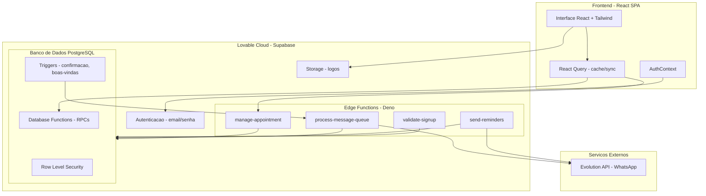

# 💅 Flores de Sião — SaaS Multi-Tenant para Clínicas de Estética

Sistema completo de gestão para clínicas de estética com agendamento online, comunicação via WhatsApp (Evolution API), controle financeiro e relatórios — tudo em uma plataforma multi-tenant.

---

## 📋 Visão Geral

O Flores de Sião é um SaaS que permite que **múltiplas clínicas** operem de forma independente dentro da mesma aplicação. Cada clínica (tenant) possui seus próprios clientes, serviços, equipe, agendamentos e configurações, completamente isolados via Row Level Security (RLS) no banco de dados.

### Funcionalidades Principais

| Módulo                 | Descrição                                                                              |
| ---------------------- | -------------------------------------------------------------------------------------- |
| **Agendamento Online** | Página pública para clientes escolherem clínica, serviço, profissional, data e horário |
| **Dashboard**          | Métricas em tempo real: clientes, agendamentos, pacotes ativos                         |
| **Clientes**           | Cadastro completo com histórico de atendimentos                                        |
| **Serviços & Pacotes** | Catálogo de serviços com duração/preço e pacotes de sessões                            |
| **Equipe**             | Gestão de profissionais com convites por e-mail                                        |
| **Horários**           | Configuração de disponibilidade por profissional/dia da semana                         |
| **Financeiro**         | Receitas, despesas, categorias e transações                                            |
| **Fluxo de Caixa**     | Visualização diária com gráficos de entrada/saída                                      |
| **Relatórios**         | Revenue mensal, top serviços, taxa de recorrência                                      |
| **Mensagens**          | Envio de WhatsApp via Evolution API com fila e retentativas                            |
| **Configurações**      | Dados da clínica, logo, hero personalizado, controle de cadastro                       |

---

## 🏗️ Arquitetura



### Decisões Técnicas

- **Multi-tenancy via RLS**: Cada query é automaticamente filtrada pelo `tenant_id` do usuário logado através da função `get_user_tenant_id()`. Zero risco de vazamento de dados entre clínicas.
- **Database Functions (RPCs)**: Lógica de negócio complexa (disponibilidade, agendamento, relatórios) reside no banco via `SECURITY DEFINER` functions, garantindo atomicidade e performance.
- **Event-driven messaging**: Triggers no banco inserem mensagens na fila (`messages_queue`). A Edge Function `process-message-queue` processa a fila e envia via Evolution API.
- **Formatação de telefone**: Clientes cadastram DDD + número (ex: `11999887766`). As Edge Functions convertem automaticamente para o formato internacional `5511999887766` exigido pela Evolution API.
- **Autenticação customizada**: Edge Functions usam `verify_jwt = false` no deploy e validam o JWT no código via header `Authorization`, permitindo flexibilidade no controle de acesso.

---

## 🛠️ Tecnologias

### Frontend

| Tecnologia         | Uso                                               |
| ------------------ | ------------------------------------------------- |
| **React 18**       | Framework principal                               |
| **TypeScript 5**   | Tipagem estática                                  |
| **Vite 5**         | Build tool                                        |
| **Tailwind CSS 3** | Estilização utilitária                            |
| **shadcn/ui**      | Componentes de UI (Radix + Tailwind)              |
| **React Query**    | Cache, sync e gerenciamento de estado server-side |
| **React Router 6** | Roteamento SPA (HashRouter)                       |
| **Recharts**       | Gráficos e visualizações                          |
| **date-fns**       | Manipulação de datas                              |
| **Lucide React**   | Ícones                                            |
| **next-themes**    | Dark/light mode                                   |
| **Sonner**         | Toast notifications                               |
| **Zod**            | Validação de schemas                              |

### Backend (Lovable Cloud / Supabase)

| Tecnologia                | Uso                       |
| ------------------------- | ------------------------- |
| **PostgreSQL**            | Banco de dados com RLS    |
| **Edge Functions (Deno)** | Lógica serverless         |
| **Supabase Auth**         | Autenticação email/senha  |
| **Supabase Storage**      | Upload de logos           |
| **Database Functions**    | RPCs para lógica complexa |

### Integrações

| Serviço           | Uso                                                    |
| ----------------- | ------------------------------------------------------ |
| **Evolution API** | Envio de WhatsApp (confirmações, lembretes, mensagens) |

---

## 📁 Estrutura de Pastas

```
├── src/
│   ├── components/         # Componentes reutilizáveis
│   │   ├── ui/             # shadcn/ui (Button, Card, Dialog, etc.)
│   │   ├── AppLayout.tsx   # Layout principal com sidebar
│   │   ├── ConfirmDialog.tsx
│   │   ├── MathCaptcha.tsx
│   │   ├── PaginationControls.tsx
│   │   └── PasswordInput.tsx
│   ├── contexts/
│   │   └── AuthContext.tsx  # Contexto de autenticação global
│   ├── hooks/
│   │   ├── useTenantData.ts # Hooks para dados do tenant
│   │   └── useCrudMutations.ts # Mutations genéricas de CRUD
│   ├── integrations/
│   │   └── supabase/
│   │       ├── client.ts    # Cliente Supabase (auto-gerado)
│   │       └── types.ts     # Tipos do banco (auto-gerado)
│   ├── pages/               # Páginas da aplicação
│   │   ├── Home.tsx         # Landing page + seleção de clínica
│   │   ├── Auth.tsx         # Login / Cadastro
│   │   ├── Dashboard.tsx    # Painel principal
│   │   ├── Appointments.tsx # Gestão de agendamentos
│   │   ├── Clients.tsx      # Gestão de clientes
│   │   ├── Services.tsx     # Catálogo de serviços
│   │   ├── Packages.tsx     # Pacotes de sessões
│   │   ├── Team.tsx         # Equipe e convites
│   │   ├── Messages.tsx     # WhatsApp + Evolution API
│   │   ├── Finance.tsx      # Transações financeiras
│   │   ├── CashFlow.tsx     # Fluxo de caixa
│   │   ├── Reports.tsx      # Relatórios e métricas
│   │   ├── Settings.tsx     # Configurações da clínica
│   │   ├── BusinessHours.tsx # Horários de funcionamento
│   │   ├── StaffManagement.tsx # Gestão de atendentes
│   │   ├── Suppliers.tsx    # Fornecedores
│   │   └── PublicBooking.tsx # Agendamento público
│   ├── lib/
│   │   └── utils.ts         # Utilitários (cn, etc.)
│   └── index.css            # Design tokens e tema
├── supabase/
│   ├── functions/
│   │   ├── manage-appointment/   # CRUD atômico de agendamentos
│   │   ├── process-message-queue/ # Fila de mensagens → Evolution API
│   │   ├── send-reminders/       # Lembretes 24h antes
│   │   └── validate-signup/      # Validação de cadastro
│   └── config.toml               # Configuração do projeto
├── .env_exemplo                   # Exemplo de variáveis de ambiente
└── config_exemplo.toml            # Exemplo de config para deploy
```

---

## 🔄 Fluxos Principais

### 1. Agendamento Público

1. Cliente acessa a home → seleciona clínica
2. Escolhe serviço → profissional → data → horário disponível
3. Preenche nome, telefone e e-mail
4. RPC `create_public_appointment` cria/encontra o cliente e insere o agendamento
5. Trigger `auto_appointment_confirmation` enfileira mensagem de confirmação
6. Edge Function `process-message-queue` envia via WhatsApp

### 2. Envio de Mensagens

1. Usuário seleciona cliente e digita mensagem na aba "Enviar"
2. RPC `queue_message` insere na `messages_queue` + `messages`
3. Admin clica "Processar Fila" → invoca `process-message-queue`
4. Edge Function busca pendentes, formata telefone (BR → `55DDD9XXXX`), envia via Evolution API
5. Status atualizado: `queued` → `sent` ou `failed` (com retry)

### 3. Lembretes Automáticos

1. Edge Function `send-reminders` busca agendamentos nas próximas 24h
2. Verifica se já existe lembrete enviado
3. Formata mensagem e envia via Evolution API do tenant
4. Registra na tabela `reminders`

### 4. Multi-tenancy

1. Cadastro cria tenant + profile (role `admin`) via `setup_new_tenant`
2. Admin convida membros via `team_invitations` com token único
3. Membro aceita convite via `accept_invitation` → cria profile vinculado ao tenant
4. Toda query passa por RLS: `tenant_id = get_user_tenant_id()`

---

## 🚀 Como Rodar Localmente

### Pré-requisitos

- Node.js 18+
- npm, bun ou pnpm

### Instalação

```bash
# Clonar o repositório
git clone <url-do-repositorio>
cd FloresDeSiao

# Instalar dependências
npm install

# Configurar variáveis de ambiente
cp .env_exemplo .env
# Editar .env com seus valores reais

# Rodar em desenvolvimento
npm run dev
```

A aplicação estará disponível em `http://localhost:5173`.

### Testes

```bash
npm run test
```

---

## 🔐 Variáveis de Ambiente

| Variável                        | Descrição                        |
| ------------------------------- | -------------------------------- |
| `VITE_SUPABASE_URL`             | URL do projeto Supabase          |
| `VITE_SUPABASE_PUBLISHABLE_KEY` | Chave anon (pública) do Supabase |
| `VITE_SUPABASE_PROJECT_ID`      | ID do projeto Supabase           |

> ⚠️ No Lovable Cloud, essas variáveis são gerenciadas automaticamente.

### Secrets (Edge Functions)

| Secret                      | Descrição                                      |
| --------------------------- | ---------------------------------------------- |
| `SUPABASE_URL`              | URL interna do Supabase                        |
| `SUPABASE_ANON_KEY`         | Chave anon para client com contexto de usuário |
| `SUPABASE_SERVICE_ROLE_KEY` | Chave admin para operações sem RLS             |
| `LOVABLE_API_KEY`           | Chave da plataforma Lovable                    |

---

## 📐 Padrões e Boas Práticas

### Código

- **Componentes pequenos e focados**: cada página é autocontida com seus hooks
- **Design tokens semânticos**: cores via CSS variables em `index.css`, nunca hardcoded
- **shadcn/ui customizado**: componentes Radix + Tailwind com variantes
- **React Query para tudo**: cache, invalidação e sync automático
- **Hooks customizados**: `useTenantData` abstrai queries por tenant

### Banco de Dados

- **RLS em todas as tabelas**: isolamento total entre tenants
- **`SECURITY DEFINER` functions**: lógica complexa no banco, não no frontend
- **Triggers para automação**: confirmações e boas-vindas automáticas
- **Validação via triggers**: em vez de `CHECK` constraints (evita problemas com `now()`)

### Edge Functions

- **`verify_jwt = false`**: JWT validado no código, não no gateway
- **Formatação de telefone**: conversão automática para formato internacional BR
- **Retry com backoff**: fila de mensagens com até 3 tentativas
- **Two-client pattern**: client com token do usuário (RLS) + client admin (service role)

### Segurança

- **Nunca `window.alert/confirm/prompt`**: sempre toast ou modal
- **Roles no profile**: admin, user, staff — verificados via RLS e no frontend
- **Convites com token + expiração**: acesso controlado à clínica
- **Input validation**: Zod no frontend, constraints no banco

---

## 📊 Tabelas do Banco

| Tabela                   | Descrição                                               |
| ------------------------ | ------------------------------------------------------- |
| `tenants`                | Clínicas (multi-tenant)                                 |
| `profiles`               | Usuários vinculados a um tenant                         |
| `clients`                | Clientes da clínica                                     |
| `services`               | Serviços oferecidos                                     |
| `packages`               | Pacotes de sessões                                      |
| `client_packages`        | Pacotes adquiridos por clientes                         |
| `appointments`           | Agendamentos                                            |
| `business_hours`         | Horários por profissional/dia                           |
| `staff_services`         | Vínculo profissional ↔ serviço                          |
| `messages`               | Log de mensagens enviadas                               |
| `messages_queue`         | Fila de envio (pending → processing → completed/failed) |
| `reminders`              | Lembretes de agendamento                                |
| `financial_transactions` | Transações financeiras                                  |
| `financial_categories`   | Categorias (receita/despesa)                            |
| `suppliers`              | Fornecedores                                            |
| `evolution_instances`    | Instâncias da Evolution API por tenant                  |
| `team_invitations`       | Convites para membros da equipe                         |
| `tenant_settings`        | Configurações do tenant                                 |
| `settings_audit_log`     | Auditoria de alterações                                 |

---

## 🔗 Links Úteis & Tutoriais

Preparamos alguns materiais para te ajudar na jornada:

- 📺 [Guia de Setup do Projeto](https://youtu.be/NYizwEbWlHA)
- ☁️ [Como criar seu Projeto no Supabase](https://youtu.be/12ZPw-NmhZg)
- 🚀 [Deploy Supabase via CLI (Vídeo)](https://youtu.be/YTH2m8o7XOg)
- 📑 [Guia de Deploy (Documentação)](https://deploysupabaseviacli.lovable.app)

---

## 🌐 Compatibilidade de Hospedagem

O Quiz Builder foi desenvolvido para ser flexível e rodar em qualquer lugar:

- 🚀 **Vercel / Netlify / Cloudflare Pages:** Deploy otimizado.
- 💻 **Hospedagem Compartilhada:** Compatível (via Apache/cPanel).
- ☁️ **VPS:** Performance máxima.

---

## 🛠️ Configuração Local

1.  **Variáveis de Ambiente:**
    Crie/Configure o arquivo `.env`:

    ```env
    VITE_SUPABASE_PROJECT_ID=
    VITE_SUPABASE_PUBLISHABLE_KEY=
    VITE_SUPABASE_URL=
    ```

2.  **Supabase:**
    Configure o arquivo `config.toml` com o `project_id` do seu projeto.

3.  **Instalação:**
    ```bash
    npm install
    npm run dev
    ```

---

## Desabilitar verificação de e-mail no Supabase

Para desabilitar a verificação de e-mail no Supabase, siga os passos abaixo:

1. Acesse o dashboard do Supabase
2. Clique em Authentication
3. Clique em Settings
4. Desabilite a opção "Require email confirmation"

## 📦 Deploy

Para deploy em produção, recomendamos o uso do **Deploy Manager Pro** ou a integração nativa do Supabase CLI para uma experiência simplificada e segura.

<p align="center">
  Desenvolvido por <a href="https://afcode.com.br">afcode</a> com ❤️ para otimizar a gestão de clínicas de estética.
</p>
